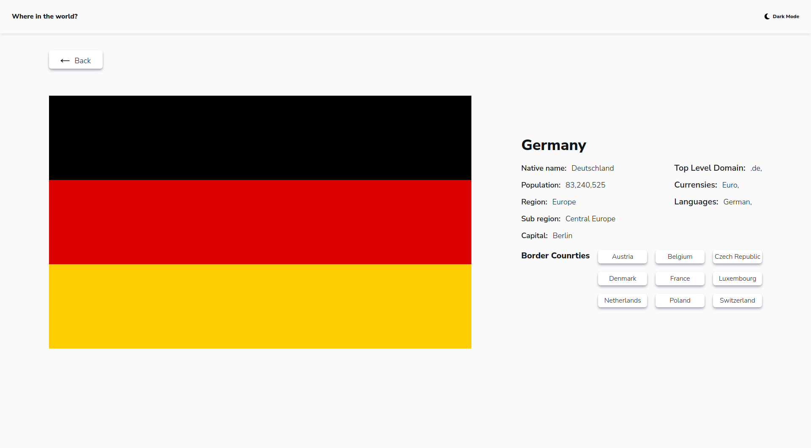

# REST Countries API with color theme switcher solution

This is a solution to the [REST Countries API with color theme switcher challenge on Frontend Mentor](https://www.frontendmentor.io/challenges/rest-countries-api-with-color-theme-switcher-5cacc469fec04111f7b848ca).

## Table of contents

- [Overview](#overview)
  - [The challenge](#the-challenge)
  - [Screenshots](#screenshots)
- [Links](#links)
- [Built with](#built-with)

## Overview

### The challenge

Users should be able to:

- See all countries from the API on the homepage
- Search for a country using an `input` field
- Filter countries by region
- Click on a country to see more detailed information on a separate page
- Click through to the border countries on the detail page
- Toggle the color scheme between light and dark mode

### Screenshots

#### Light mode mobile design

#### Dark mode mobile design

#### Option to filter by region

####Option to filter by region and use input filde to search for specific country

#### If you click on country card you can view detaild information

#### Details mobile design(light mode)

#### Details mobile design(dark mode)

#### Light mode desktop design

#### Dark mode desktop design

#### Details desktop design(light mode)

#### Details desktop design(light mode)

## Links

- Live Site URL: in progress

## Built with

- Semantic HTML5 markup
- Mobile-first workflow
- Tailwind
- [React](https://reactjs.org/) - JS library
